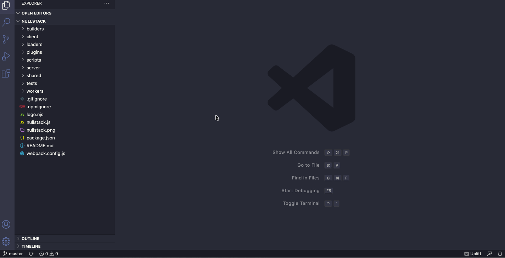
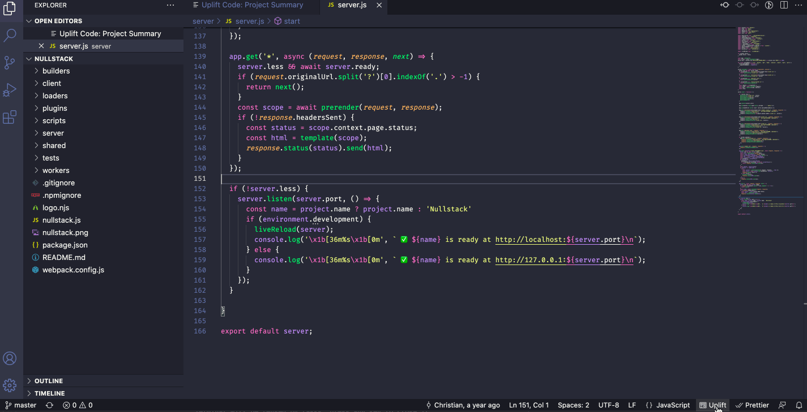

# Uplift Code

Code metrics and insights for Git projects.

## Getting started

1. Install the extension
2. Open your project as a [vscode workspace](https://code.visualstudio.com/docs/editor/workspaces)
3. Open details about the active file by clicking on the extension's status bar item or by lauching the "Uplift Code: Show Project Summary" command.

### Project summary

Open a Project Summary tab displaying metrics information about the entire project by using the "Uplift Code: Show Project Summary" command or by clicking in the status bar item "Uplift Code" while no active file is open.

### File summary

Open a File Summary tab displaying metrics information about the active file by clicking in the status bar item "Uplift Code".

## Metrics

Here's an overview of all metrics calculated by UpliftCode and their meaning.

By default, all metrics are calculated taking in account the git commits done in the last 12 months. This can be changed with the `upliftCode.since` settings configuration.

### Churn

Churn or file churn is the number of times a file has changed in a given time range, calculated by counting the number of commits this file appears on. It will tell you which files are the ones that are constantly changing, thus the ones more likely to be hotspots of bugs or related to features with constant requirement changes.

**Potential reasons / what to do:**

- Bugfixing / poor code design

  Small frequent commits can indicate a poor designed code, lack of test coverage or other smells that are constantly causing bugs in your product. Consider refactoring or breaking into multiple files or modules with single or less reponsibilities

- Unclear requirements / indecisive stakeholders

  Review the requirements with your steakholders and make sure there's a clear accepting criteria

- Difficult problem

  Avoid bikeshedding and be mindful if a challenge is taking too long. Be proactive, ask for help when needed.

**To learn more:**

- [Introduction to code churn](https://www.pluralsight.com/blog/tutorials/code-churn)
- [6 Causes of Code Churn and What You Should Do About Them](https://www.pluralsight.com/blog/teams/6-causes-of-code-churn-and-what-you-should-do-about-them)

### File coupling

File coupling is a potential code smell that occurs when you have an implicit temporal relationship between two or more files in a project. If files A and B are constantly changed together, in the same commit, they are probably coupled or tighly related to each other.

### Complexity / Complexity trend

Coming soon.
